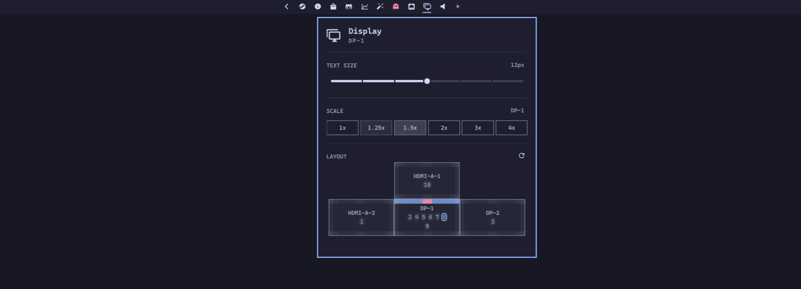

# Omarchy Monitors Plugin



Status bar, notification daemon, and per-monitor layout controls in one plugin.

## Install

```bash
omarchy plugin add https://github.com/sebday/omarchy-monitors.git
omarchy plugin enable evo.monitors
```

## Panel

Add the Monitors widget to the bar layout (`evo.monitors`) to open the panel. From there you can:

- Adjust brightness and scale per output
- Toggle bar and notification placement per monitor
- Reset layout to Omarchy defaults

## IPC

```bash
omarchy-shell shell toggle evo.monitors '{}'
omarchy-shell notifications toggleDnd
omarchy-shell notifications showHistory
```
